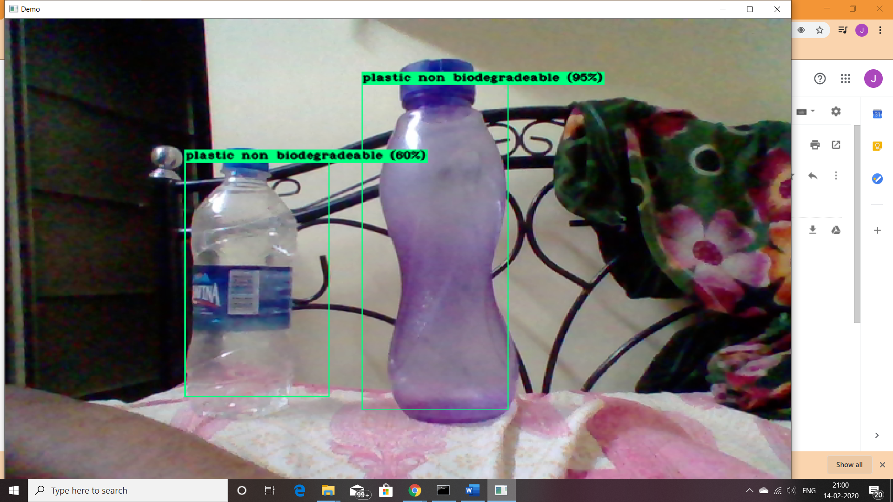
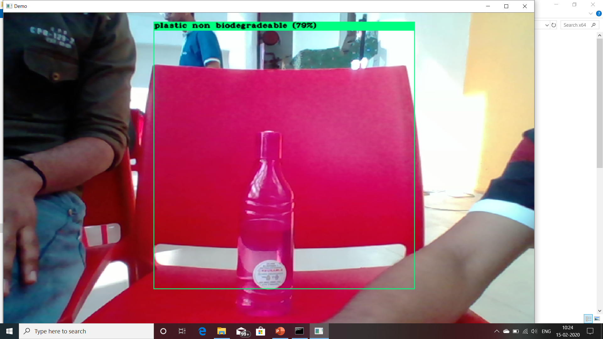
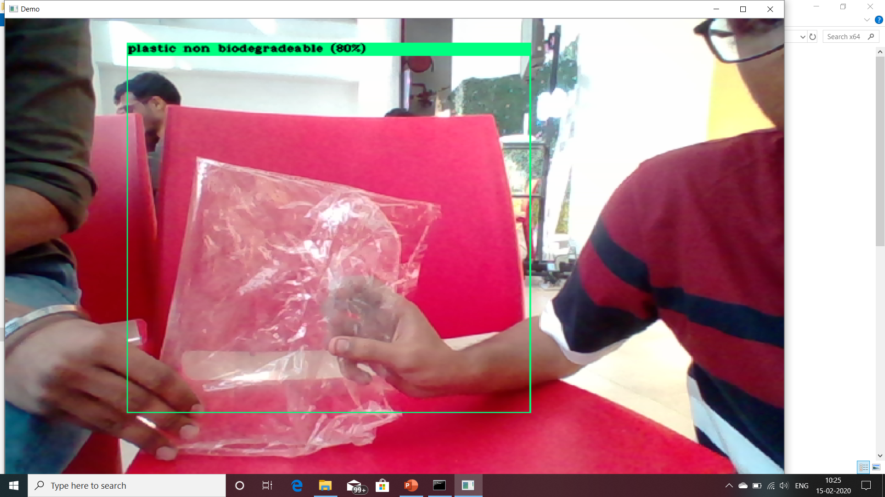
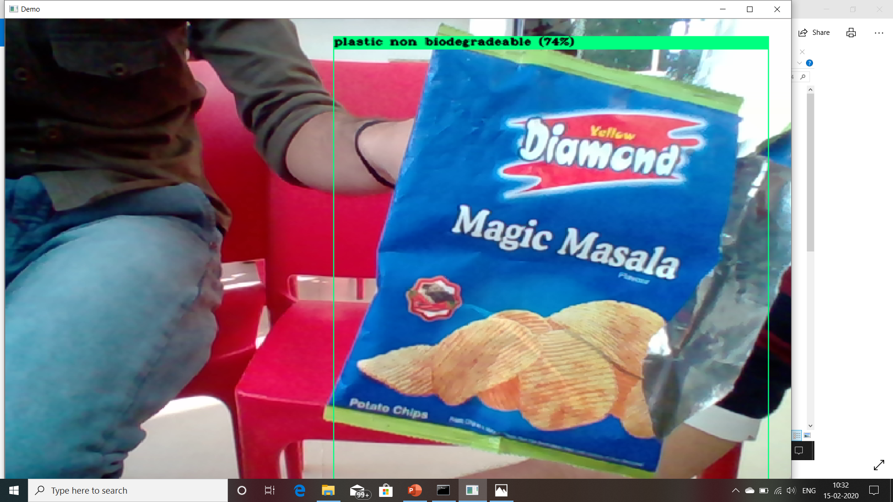
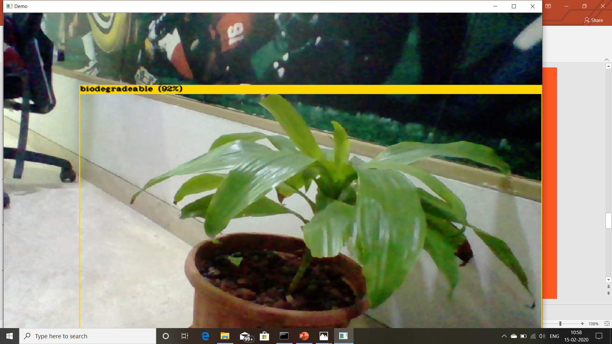
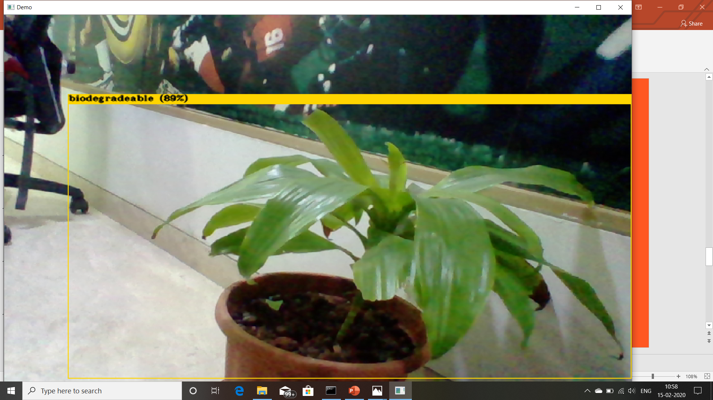

    

# Garbage Profiling
>About Garbage_profiling: I had recommended 6 classes namely plastic, paper, cardboard, metal, other nonbiodegradable, and biodegradable.
>This model has the ability to detect garbage by input image or in real-time

### [Dataset](https://www.kaggle.com/techsash/waste-classification-data)

## Output (1)

## Output (2)

## Output (3)

## Output (4)

## Output (5)

## Output (6)

## Output (7)

## Output (8)

## Output (9)

## Output (10)

## Output (11)

## Output (12)

## Output (13)

## Output (14)

**>If you find any difficulty or error you can reach me by email : gupta29470@gmail.com**

**>Thankyou,**
*Valar Dohaeris!*
